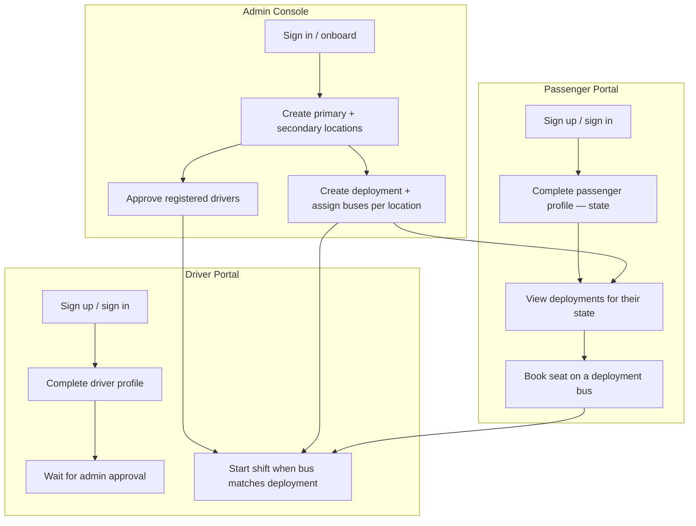
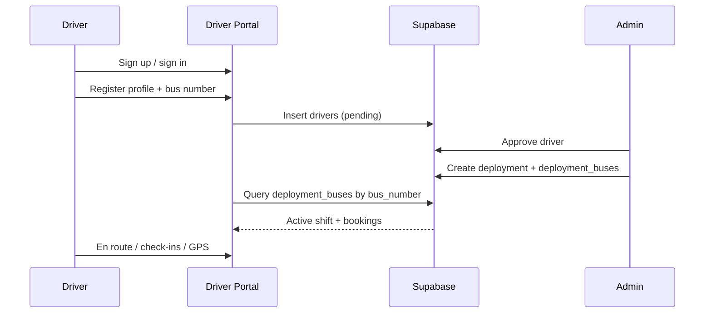
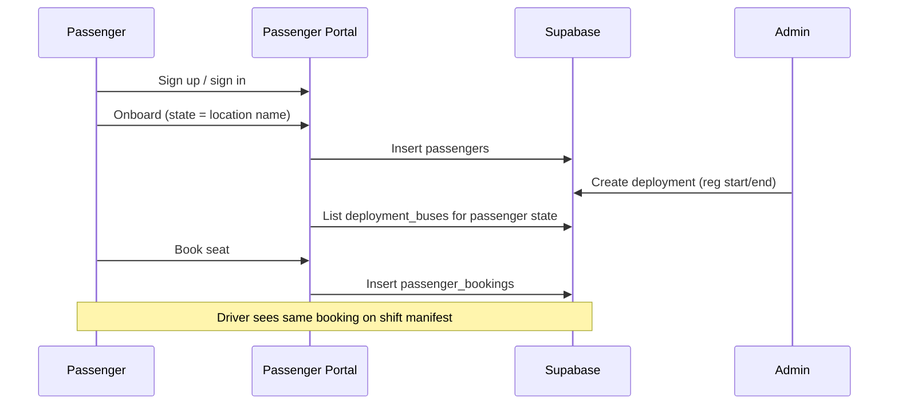
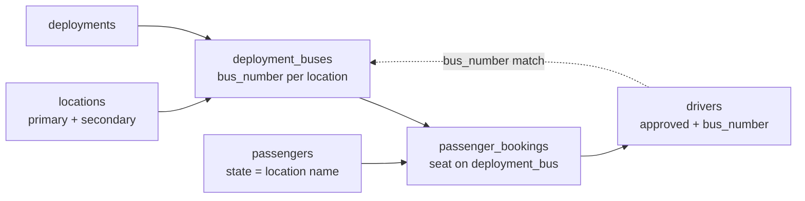

# CityBus — User & Operations Flow

End-to-end flow for admins, drivers, and passengers. Arrows show the **recommended operational order**; driver and passenger signups can happen in parallel once locations exist.

---

## High-level flow

---

## 1. Admin flow

| Step | Action | System |
|------|--------|--------|
| 1 | Admin signs in via **Admin Console** | Supabase Auth + `user_roles` = `admin` |
| 2 | First admin completes onboarding (profile, optional seed of Lagos + Port Harcourt) | `locations`: one **primary** (Redemption Camp / Lagos hub), optional **secondary** nodes |
| 3 | Add more **secondary locations** (state pickup points) under **Transit Nodes** | `locations` (`type: secondary`, name, lat/lng on map) |
| 4 | Review **Drivers** tab — approve or reject pending applications | `drivers.status` → `approved` / `rejected` |
| 5 | **New Deployment** — name, registration window, departure time | `deployments` |
| 6 | For each secondary location, allocate **bus numbers** (e.g. `Bus 12`, `Bus 15`) | `deployment_buses` (`deployment_id`, `location_id`, `bus_number`) |

**Notes**

- **Primary location** = hub (e.g. Lagos / Redemption Camp). **Secondary** = interstate origin states (e.g. Port Harcourt, Abuja).
- Admin does **not** pick a driver UUID on the deployment form. Assignment is by **matching** the driver’s registered `bus_number` to a `deployment_buses.bus_number` for that event.

---

## 2. Driver flow

| Step | Action | System |
|------|--------|--------|
| 1 | Open **Driver Portal** → Sign up (email/password or Google) | Supabase Auth |
| 2 | Submit **driver registration** (name, phone, license, vehicle, **bus number**) | `drivers` row, `status: pending` |
| 3 | Admin **approves** driver | `drivers.status` = `approved` |
| 4 | When a deployment lists their bus number, driver sees **active shift** (route, manifest, map) | Match `drivers.bus_number` = `deployment_buses.bus_number` |
| 5 | Update ride status, broadcast GPS, check in passengers | `drivers.ride_status`, location updates, `passenger_bookings` check-in |

---

## 3. Passenger flow

| Step | Action | System |
|------|--------|--------|
| 1 | Open **Passenger Portal** → Sign up / sign in | Supabase Auth |
| 2 | **Onboarding** — full name, phone, **state** (must match a `locations.name`, e.g. `Port Harcourt`) | `passengers` + `user_roles` = `passenger` |
| 3 | After admin opens registration window, view **active deployments** for their state | `deployment_buses` + `deployments` filtered by `locations.name` = `passengers.state` |
| 4 | Select bus → pick **seat** → confirm booking | `passenger_bookings` |
| 5 | Track booking / bus on map during event | Live data from deployment + driver GPS |

---

## 4. How roles connect at runtime

| Link | Rule |
|------|------|
| Passenger ↔ location | `passengers.state` = `locations.name` (secondary node) |
| Passenger ↔ bus | Books a row on `deployment_buses` for an open deployment |
| Driver ↔ bus | `drivers.bus_number` = `deployment_buses.bus_number` |
| Admin ↔ fleet | Creates locations, approves drivers, publishes deployments and bus slots |

---

## 5. Recommended timeline (e.g. RCCG convention)

1. **Admin** — Seed primary hub + add all secondary state locations.  
2. **Drivers** — Sign up and register bus numbers (parallel).  
3. **Passengers** — Sign up and set home state (parallel).  
4. **Admin** — Approve drivers; create deployment with registration dates and bus allocations per state.  
5. **Passengers** — Book seats during the registration window.  
6. **Drivers** — Open portal on departure day; matched buses get shift, manifest, and GPS tracking.  
7. **Admin** — Monitor fleet, bookings, and analytics in the control room.

---

## Portal entry points

| Role | Route | URL path |
|------|-------|----------|
| Admin | Admin Console | `/admin` |
| Driver | Driver Portal | `/driver` |
| Passenger | Passenger Portal | `/passenger` |
